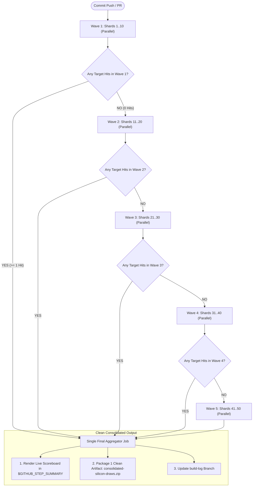

# GitHub Actions CI Architecture & Silicon Verification Guide

This directory contains the GitHub Actions workflow definition for the high-frequency trading (HFT) engine repository.

---

## 1. Overview & Problem Context

The core engine relies heavily on microarchitectural execution unit optimization, AVX-512 vector pipelines, and dual 512-bit `VPCLMULQDQ` carry-less multiplication units (e.g., Intel Xeon Platinum 8573C Sapphire Rapids / Emerald Rapids).

Standard GitHub-hosted cloud runners (`ubuntu-latest`) randomly draw from heterogeneous Azure VM host pools:
- **Intel Xeon Platinum 8573C** (Sapphire Rapids / Emerald Rapids — Dual 512-bit ports, target record silicon)
- **Intel Xeon Platinum 8370C** (Ice Lake — Single 512-bit clmul port, validated baseline)
- **AMD EPYC 7763 / 7B13 / Zen series** (Non-target for AVX-512 / VPCLMULQDQ peak records)

---

## 2. The 5-Wave Cascading Multi-Shard Architecture (Up to 50 Shards)

To turn silicon acquisition into a **99.99% deterministic guarantee** in a single workflow run with zero wasted runner minutes, CI uses a **Cascading Multi-Wave Architecture** across 5 sequential waves of 10 parallel shards.



### Cumulative Probability Table
With target acquisition probability $p \approx 0.20$ per runner:

| Wave | Shard Range | Cumulative Shards | Cumulative Hit Probability | Runtime Behavior |
| :---: | :---: | :---: | :---: | :--- |
| **Wave 1** | 1..10 | 10 | **$89.3\%$** | $\sim 90\%$ of workflow runs succeed here in $< 3\text{ minutes}$. |
| **Wave 2** | 11..20 | 20 | **$98.8\%$** | Auto-fires only if Wave 1 yields 0 target hits. |
| **Wave 3** | 21..30 | 30 | **$99.87\%$** | Auto-fires only if Waves 1 & 2 yield 0 target hits. |
| **Wave 4** | 31..40 | 40 | **$99.986\%$** | Fail-safe wave. |
| **Wave 5** | 41..50 | 50 | **$\mathbf{99.9986\%}$** | **$1\text{ in }71,000$ chance of missing**. Virtually 100% deterministic. |

---

## 3. Workflow Jobs Breakdown

### Phase 1: Cascading Shard Waves (Waves 1 through 5)
1. **Fast-Discard Gate (`< 1s`)**:
   - Inspects `/proc/cpuinfo` for model substrings (`8573C` or `8370C`).
   - If non-matching, immediately sets `matched=false` and skips all subsequent steps.
   - Discarded jobs finish in $\sim 2\text{--}4\text{ seconds}$, consuming negligible compute minutes.
2. **Full Build & Benchmark (Matching Shards Only)**:
   - Restores shared Rust Cargo cache via `Swatinem/rust-cache@v2`.
   - Runs `./scripts/ci.sh` executing differential suites D1–D12, `hft_bench`, `kbench`, `fbench`, and matrix sweeps.
   - Extracts key metrics (`sustained_rate`, `kbench_1t`, `bit_parity`, `allocs`) into `shard_meta.json`.
   - Uploads an ephemeral per-shard result chunk.
3. **Automatic Short-Circuit Evaluation (`check-wave-N`)**:
   - Uses `actions/github-script` to inspect uploaded artifacts.
   - If target artifacts were produced, subsequent waves are **automatically skipped**.

### Phase 2: `aggregate-and-report` (Collector)
1. **Downloads all shard result chunks** across any executed waves.
2. **Renders Live Scoreboard**: Populates `$GITHUB_STEP_SUMMARY` with a formatted Markdown table comparing all winning draws on the run summary page.
3. **Consolidates Artifacts**: Merges all draw logs into **1 single clean artifact bundle**:
   ```
   📦 consolidated-silicon-draws.zip
      ├── draw-shard2.log
      ├── draw-shard14.log
      ├── bench_hydra.txt
      ├── kbench.txt
      └── bench_results.json
   ```
4. **Updates `build-log` Branch**: Automatically syncs execution logs and run metadata to the orphan `build-log` branch with zero force-push race conditions.

---

## 4. Key Invariant Gates Enforced in Every Draw

Every successful silicon draw must pass all strict invariants:
- **Bit-Exact Golden Parity**: `HYDRA_BITPARITY == 0x881639cead506f25` / `0xF6EF154EFDE905D8`.
- **Zero Allocations**: `ALLOC_DELTA == 0` across all replay and benchmark windows.
- **Differential Oracle**: 100% pass across D1–D12 suites and 17-cell matrix sweep.
- **Clean Architecture Audits**: `#![forbid(unsafe_code)]` compliance on protocol/arbitrator and no mailbox allocations.

---

## 5. Local Emulation

To run the full suite locally on an x86_64 machine:
```bash
# Run complete test & verification suite
./scripts/ci.sh

# Run specific microbenchmarks
cargo run --release -p nf-engine --bin kbench
cargo run --release -p nf-engine --bin bench -- --hydra-only
```
