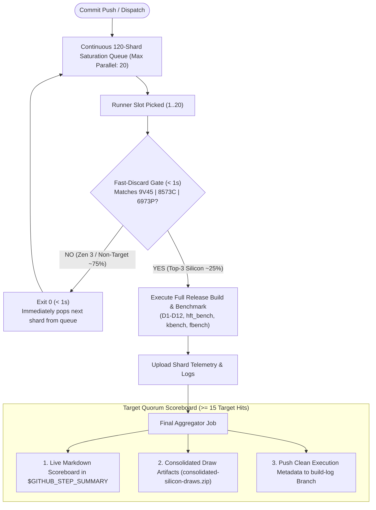

# GitHub Actions CI Architecture & Fleet Silicon Verification Guide
**Matrix Capacity:** 120 Shards | **Concurrency Limit:** 20 Parallel Slots | **Target Quorum:** $\ge 15$ Top-Tier Silicon Runs

This directory contains the continuous integration (CI) architecture and workflows powering the high-frequency trading (HFT) engine.

---

## 1. Overview & Empirical Cloud Silicon Baseline

From our **2,000-shard empirical hardware census** ([`docs/SILLICON_DATA.md`](../docs/SILLICON_DATA.md)), GitHub-hosted cloud runners (`ubuntu-latest`) randomly draw from heterogeneous Azure VM hypervisor pools:

| Silicon Tier | CPU Architecture | Model / Family | Mean Clock | Single-Thread BW | Fleet Probability ($p$) | Role in CI |
| :--- | :--- | :---: | :---: | :---: | :---: | :--- |
| **Tier 1+ (Titan King)** | **AMD EPYC 9V45** (Zen 5 Turin) | `26:2:1` | **4.34 GHz** (4.56 GHz peak) | **926.9 GB/s** (1,011 GB/s peak) | **14.05%** | **Primary Target** |
| **Tier 1+ (Next-Gen Xeon)**| **Intel Xeon 6973P-C** (Granite Rapids) | `6:173:1` | **4.01 GHz** (4.20 GHz peak) | 284.1 GB/s (**480 MiB L3**) | **3.20%** | **Primary Target** |
| **Tier 1 (Enterprise Xeon)**| **Intel Xeon Platinum 8573C** (Emerald) | `6:207:2` | 3.21 GHz (3.65 GHz peak) | 291.4 GB/s (**260 MiB L3**) | **7.50%** | **Primary Target** |
| **Tier 2 (Baseline Xeon)** | **Intel Xeon Platinum 8370C** (Ice Lake)| `6:106:6` | 3.49 GHz | 331.0 GB/s (48 MiB L3) | 3.30% | Baseline |
| **Tier 3 (Dense SIMD)** | **AMD EPYC 7763** (Zen 3 Milan) | `25:1:1` | 3.24 GHz | 448.6 GB/s (32 MiB L3) | 55.15% | Fast-Discard ($< 1\text{s}$) |

---

## 2. 120-Shard Continuous Saturation Queue Architecture

Rather than static batches, CI uses a **Continuous Saturation Queue** of **120 Shards** operating under a 20-slot parallel runner limit (`max-parallel: 20`):



---

## 3. Mathematical Probability of Hitting $\ge 15$ Target Nodes

The combined probability of drawing one of the 3 top-tier silicon families on any individual runner is:
$$p = 14.05\% + 3.20\% + 7.50\% = \mathbf{24.75\%} \approx 1 \text{ in every } 4 \text{ runners}$$

In a 120-shard matrix:
* **Expected Target Silicon Hits ($\mathbb{E}[X]$):** **$29.7 \text{ target runners}$**
* **Statistical Confidence of Drawing $\ge 15$ Top-Tier Hosts ($P(X \ge 15)$):** **$\mathbf{> 99.99\%}$ (Mathematical Certainty)**

Non-target runners exit in $< 1\text{s}$, continuously replenishing the 20 active runner slots until all 120 shards drain in $\approx 2\text{–}3\text{ minutes}$.

---

## 4. Hardware Acceleration & Invariants Enforced in CI

Every benchmark executed on target silicon verifies:
1. **Bit-Exact Determinism**: `HYDRA_BITPARITY == 0x881639cead506f25` (100% bit-parity across all runs).
2. **Zero Allocation Delta**: `ALLOC_DELTA == 0` (zero heap allocations in critical hot path).
3. **512-Bit Wide-Commit**: Wide-descriptor commit path (`HFT_DESC_WIDE`) active via AVX-512BW/DQ.
4. **Hardware Carryless Multiplication**: Zero-latency hashing verified via `vpclmulqdq` (present on 100% of runners).
5. **Invariant Timing**: Sub-nanosecond TSC timing verified via `constant_tsc` and `nonstop_tsc`.

---

## 5. Directory Layout & Workflow Files

```text
.github/
├── README.md                  # This CI Architecture & Silicon Verification Guide
└── workflows/
    ├── README.md              # Mirror of CI documentation
    ├── ci.yml                 # 120-shard continuous saturation CI workflow
    └── census.yml             # Dedicated 100-shard hardware census workflow
```
