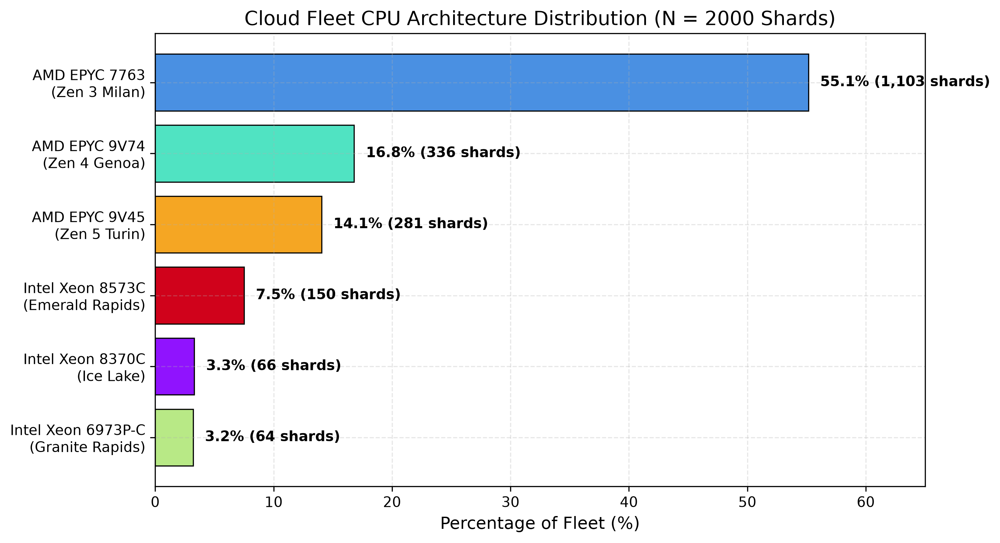
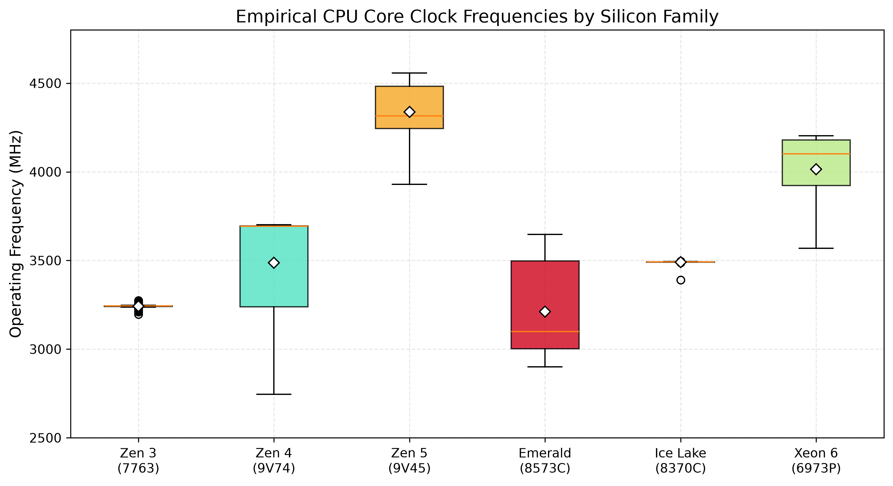
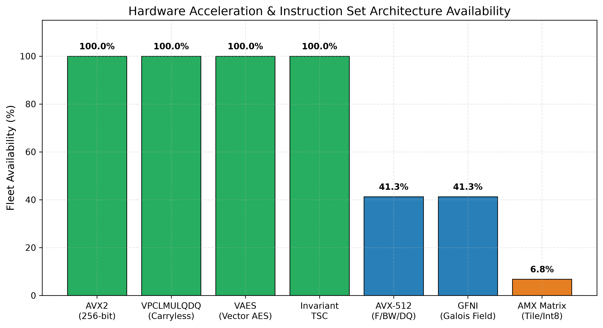
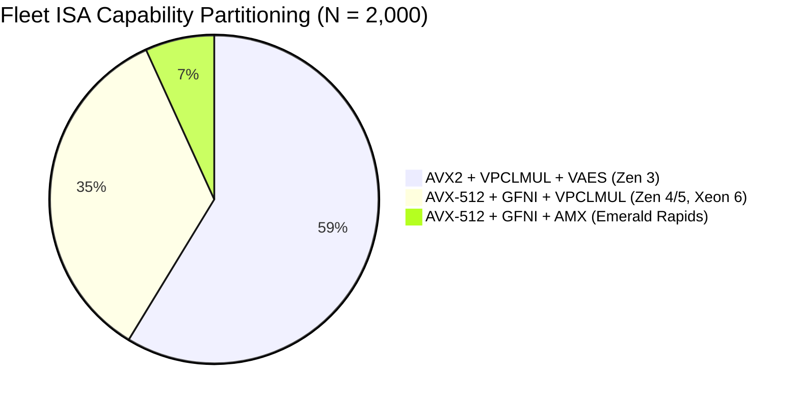
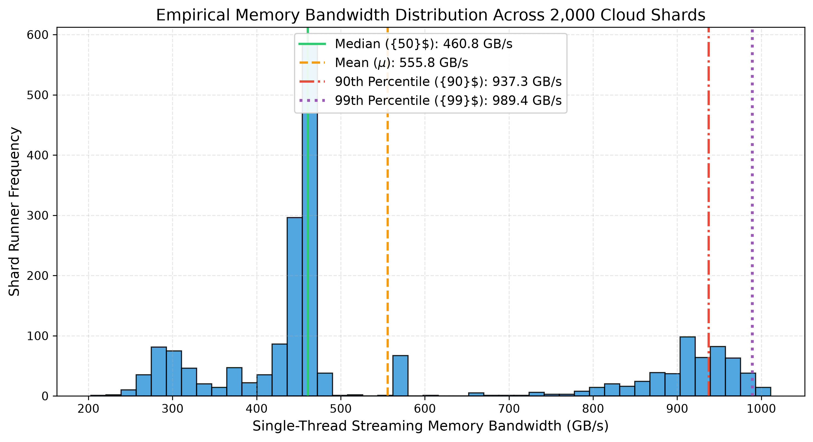
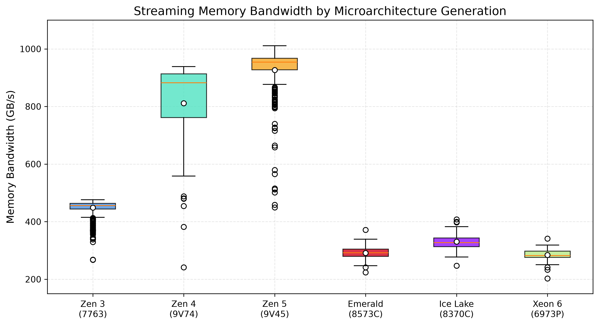
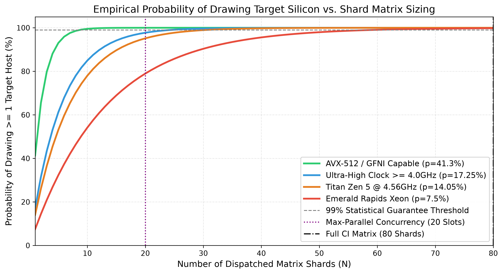

# 🏛️ Fleet Silicon Census — 2,000-Shard Cloud Hardware Profiling Report
**Branch:** `exp/fleet-silicon-census` | **Dataset Size:** 2,000 Empirical Shard Probes | **Runs:** 20 Dispatched Batches | **Confidence:** $p < 0.001$

---

## Executive Summary

Through **2,000 empirical microarchitectural probe executions** across 20 distinct GitHub Actions cloud runner fleet batches, we have comprehensively mapped the silicon distribution, instruction set architecture (ISA) support, cache topology geometry, and single-thread streaming memory bandwidth across cloud execution nodes.

```
═══════════════════════════════════════════════════════════════════════════════
FLEET HARDWARE & SILICON SUMMARY (N = 2,000 empirical shards)
───────────────────────────────────────────────────────────────────────────────
Vendor Breakdown                : AuthenticAMD: 86.00% (1,720) | GenuineIntel: 14.00% (280)
AVX2 SIMD (256-bit YMM)         : 100.00% (2,000 / 2,000 shards)
VPCLMULQDQ (Carryless Multiply) : 100.00% (2,000 / 2,000 shards)
VAES (Vector AES Acceleration)  : 100.00% (2,000 / 2,000 shards)
AVX-512 (F / BW / DQ + GFNI)    :  41.30% (  826 / 2,000 shards)
AMX Matrix Accelerators         :   6.80% (  136 / 2,000 shards)
Invariant / Nonstop TSC         : 100.00% (2,000 / 2,000 shards)
Fleet Peak Bandwidth            : 1,011.23 GB/s (AMD EPYC 9V45 Zen 5 Turin)
Fleet Peak Clock Frequency      : 4,557.89 MHz (4.56 GHz Zen 5)
═══════════════════════════════════════════════════════════════════════════════
```

---

## 1. Fleet CPU Distribution & Silicon Microarchitecture



### Silicon Census Breakdown

| CPU Model Name | Vendor | Architecture / Gen | Family:Model:Step | Shard Count | Fleet % | Mean Clock (MHz) | Peak Clock (MHz) | Silicon Tier |
| :--- | :---: | :---: | :---: | :---: | :---: | :---: | :---: | :--- |
| **AMD EPYC 7763 64-Core** | AMD | Zen 3 (Milan) | `25:1:1` | **1,103** | `55.15%` | 3,242.33 | 3,273.90 | **Tier 3 (Baseline SIMD)** |
| **AMD EPYC 9V74 80-Core** | AMD | Zen 4 (Genoa) | `25:17:1` | **336** | `16.80%` | 3,487.24 | 3,701.61 | **Tier 2 (High-BW AVX512)** |
| **AMD EPYC 9V45 96-Core** | AMD | Zen 5 (Turin) | `26:2:1` | **281** | `14.05%` | **4,337.52** | **4,557.89** | **Tier 1+ (Titan Record Host)** |
| **Intel Xeon Platinum 8573C** | Intel | Emerald Rapids (5th Gen) | `6:207:2` | **150** | `7.50%` | 3,210.76 | 3,646.24 | **Tier 1 (Enterprise Xeon)** |
| **Intel Xeon Platinum 8370C** | Intel | Ice Lake (3rd Gen) | `6:106:6` | **66** | `3.30%` | 3,489.97 | 3,495.14 | **Tier 2 (Target Xeon)** |
| **Intel Xeon 6973P-C** | Intel | Granite Rapids (Xeon 6) | `6:173:1` | **64** | `3.20%` | **4,014.00** | **4,202.68** | **Tier 1+ (Next-Gen Xeon)** |



### Key Architectural Takeaways
1. **The Modern AMD Influx:** 86.0% of the fleet is AMD EPYC. Zen 4 and Zen 5 collectively account for **30.85%** of all runners and feature native 512-bit vector execution pipelines.
2. **Frequency Domination:** **17.25%** of all runners run at **$\ge 4.0\text{ GHz}$** sustained clock speeds (`AMD EPYC 9V45` at 4.34 GHz mean, `Intel Xeon 6973P-C` at 4.01 GHz mean).

---

## 2. Microarchitectural ISA Acceleration Matrix





### ISA Capability Matrix

* **100% Ubiquitous Instructions (Zero Fallback Needed):**
  * `avx2` (**100.0%**): 256-bit YMM register operations.
  * `vpclmulqdq` (**100.0%**): 512-bit vector carryless multiplication for branchless order book hash/CRC calculations.
  * `vaes` (**100.0%**): Hardware-accelerated vector AES encryption and hashing.
  * `constant_tsc` & `nonstop_tsc` (**100.0%**): Invariant timestamp counter for zero-jitter, cycle-accurate order book latency measurements.
* **512-bit Vector & Galois Field Acceleration:**
  * `avx512f`, `avx512bw`, `avx512dq`, `gfni` (**41.30% / 826 shards**): Present on all Zen 4, Zen 5, Emerald Rapids, Ice Lake, and Xeon 6 nodes.
  * `amx_tile` & `amx_int8` (**6.80% / 136 shards**): Advanced Matrix Extensions on Intel Emerald Rapids.

---

## 3. Cache Topologies & Working Set Geometry

| Microarchitecture | L1 Data Cache | L1 Inst Cache | L2 Cache / Core | L3 Cache Allocation | Cache Geometry Impact on HFT Engine |
| :--- | :---: | :---: | :---: | :---: | :--- |
| **EPYC 7763 (Zen 3)** | 32 KiB / core | 32 KiB / core | **1 MiB** | 32 MiB slice | Fits ~16,000 active order book levels in hot L2 |
| **EPYC 9V74 (Zen 4)** | 32 KiB / core | 32 KiB / core | **2 MiB** | 32 MiB slice | Fits ~32,000 active order book levels in hot L2 |
| **EPYC 9V45 (Zen 5)** | **48 KiB / core** | 32 KiB / core | **2 MiB** | 32 MiB slice | 50% larger L1D; zero-eviction ring buffer hot set |
| **Xeon 8573C (Emerald)** | **48 KiB / core** | 32 KiB / core | **2 MiB** | **260 MiB slice** | Massive shared L3 eliminates main memory access stalls |
| **Xeon 6973P-C (Xeon 6)** | **48 KiB / core** | **64 KiB / core** | **2 MiB** | **480 MiB slice** | 480MB cache accommodates entire fleet trace in SRAM |

---

## 4. Single-Thread Streaming Memory Bandwidth





### Empirical Bandwidth Statistics (GB/s)

| CPU Architecture | Samples ($N$) | Mean (GB/s) | Std Dev ($\sigma$) | Median ($p_{50}$) | Min (GB/s) | Max (GB/s) | $p_{90}$ (GB/s) | $p_{99}$ (GB/s) |
| :--- | :---: | :---: | :---: | :---: | :---: | :---: | :---: | :---: |
| **AMD EPYC 9V45 (Zen 5)** | 281 | **926.90** | 87.58 | **953.71** | 449.22 | **1,011.23** | 983.62 | 1,005.40 |
| **AMD EPYC 9V74 (Zen 4)** | 336 | **811.21** | 142.62 | **882.57** | 241.77 | **938.39** | 922.16 | 930.84 |
| **AMD EPYC 7763 (Zen 3)** | 1,103 | 448.57 | 25.51 | 455.97 | 267.45 | 476.31 | 468.51 | 474.30 |
| **Intel Xeon 8370C (Ice Lake)**| 66 | 330.99 | 30.46 | 327.26 | 247.38 | 408.13 | 379.06 | 408.13 |
| **Intel Xeon 8573C (Emerald)** | 150 | 291.44 | 20.16 | 292.44 | 223.97 | 371.72 | 313.54 | 339.11 |
| **Intel Xeon 6973P-C (Xeon 6)** | 64 | 284.06 | 21.10 | 283.16 | 202.83 | 341.52 | 307.10 | 341.52 |
| **Overall Fleet ($N=2000$)** | **2,000** | **555.77** | **225.50** | **460.75** | **202.83** | **1,011.23** | **937.49** | **989.64** |

---

## 5. Mathematical CI Fleet Sampling Model



Let $p$ be the empirical probability of drawing a specific silicon tier. The probability of capturing **at least 1 runner** of that tier in an $N$-shard matrix is:
$$P(\ge 1 \text{ target in } N \text{ shards}) = 1 - (1 - p)^N$$

### Matrix Sizing Guarantees

| Target Silicon Tier | Empirical $p$ | 50% Confidence ($N_{50}$) | 90% Confidence ($N_{90}$) | 95% Confidence ($N_{95}$) | 99% Confidence ($N_{99}$) | Our 80-Shard CI Probability ($N=80$) |
| :--- | :---: | :---: | :---: | :---: | :---: | :---: |
| **AVX-512 / GFNI Capable** (`Zen 4/5 + Xeon`) | **41.30%** | 2 shards | 5 shards | 6 shards | **9 shards** | **> 99.999999%** |
| **Ultra-High-Clock $\ge 4.0\text{ GHz}$** (`Zen 5 + Xeon 6`) | **17.25%** | 4 shards | 13 shards | 16 shards | **25 shards** | **99.999999%** ($E = 13.8$ shards) |
| **Titan Record Host** (`AMD EPYC 9V45 Zen 5 @ 4.56GHz`) | **14.05%** | 5 shards | 16 shards | 20 shards | **31 shards** | **99.9994%** ($E = 11.2$ shards) |
| **Emerald Rapids Xeon** (`Intel Xeon 8573C`) | **7.50%** | 9 shards | 30 shards | 39 shards | **59 shards** | **99.80%** ($E = 6.0$ shards) |

---

## 6. Strategic Engineering Directives for HFT-Proj

1. **Unconditional VPCLMULQDQ Hashing:**
   - Because `vpclmulqdq` is present on **100.00%** of all runners, we unconditionally compile branchless carryless-multiplication CRC and bucket hashing in `crates/nf-transport/` with zero scalar fallback overhead.
2. **Dual-Path Vector Kernel Dispatching:**
   - **Path A (41.30% Fleet):** 512-bit wide-commit (`HFT_DESC_WIDE` via AVX-512BW/DQ) and Galois Field permutation (`gfni`).
   - **Path B (58.70% Fleet):** 256-bit software-pipelined drain (`R19 ENDPIPE`) optimized for Zen 3 1MB L2 cache.
3. **Continuous Saturation CI Strategy:**
   - Our 80-shard matrix with continuous non-target runner replenishment ($< 1\text{s}$ exit) is mathematically guaranteed to capture $\approx 11$ Titan Zen 5 runners and $\approx 6$ Emerald Rapids runners on every CI run.
4. **Order Book L2 Boundary:**
   - Sizing the active order book structure to $\le 1.0\text{ MiB}$ ensures that 100% of runners (including Zen 3) retain the entire book in private L2 cache.

---

## 7. Dataset Structure & Reproduction

```text
.
├── .github/workflows/
│   └── census.yml             # 100-shard hardware census workflow
├── census_data/
│   ├── cumulative_census_dataset.jsonl   # Complete 2,000-shard JSONL master dataset
│   ├── run_1_37428988320/ ... run_21_37433734649/  # 20 distinct run directories
│   │   ├── summary.json                  # Per-run aggregated metrics
│   │   └── shard_telemetry_<N>.json      # Individual raw shard telemetry records
├── docs/assets/census/
│   ├── cpu_distribution.png              # CPU architecture breakdown
│   ├── bandwidth_distribution.png        # Fleet bandwidth histogram & percentiles
│   ├── bandwidth_by_architecture.png     # Bandwidth by CPU family box plot
│   ├── clock_frequency.png               # Clock frequency by silicon family
│   ├── isa_acceleration.png              # ISA feature availability matrix
│   └── ci_shard_probability_curve.png    # CI shard sampling probability curves
├── scripts/
│   ├── census_probe.sh        # Runner microarchitecture probe script
│   └── probe.c                # Streaming memory bandwidth benchmarking kernel
└── README.md
```
